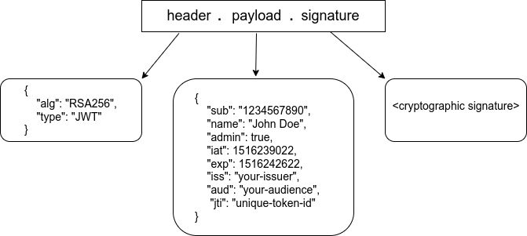
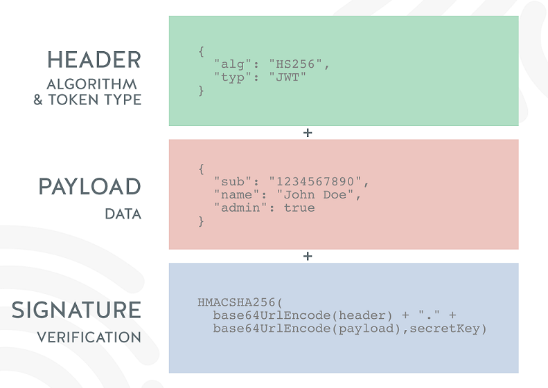

[Habr - Подробно про JWT](https://habr.com/ru/articles/842056/)  
## **Что такое JWT**

**JWT** (Json Web Token) — ключ аутентификации пользователя. Используется для запросов к защищенным методам API.

## **Для чего нужны JWT**: чтобы не передать учетные данные пользователя с каждым запросом к серверу.

**Чем JWT лучше учетных данных:**

1. Учетные данные пользователя, как правило хранятся долго (месяцы). Как бы хорошо не был зашифрован запрос, при достаточном количестве времени его можно расшифровать. Если запрос, содержащий учетные данные перехвачен злоумышленником, у него будет много времени на расшифровку. Токены доступа имеют ограниченный срок годности (обычно ~15 минут). Этого времени не достаточно, чтобы расшифровать надежный шифр. К тому времени, когда зловредный алогритм расшифрует запрос, токен уже выйдет из обращения и будет бесполезен.
    
2. Использовать учетные данные, это медленно. Для валидации учетных данных сервер должен запросить их сохраненную копию из БД и сравнить с данными, которые пришли в запросе. Обращение к БД — дорогостоящая процедура, она сильно увеличивает время обработки запроса. Токены, с другой стороны, не требуют обращения к БД для валидации. Это позволяет снизить нагрузку на БД и ускорить обработку запросов сервером.
    

**Время жизни токенов.** Каждый токен имеет определенный срок годности. Эта информация зашита в его теле. При валидации, сервер извлекает данные из токена и проверяет, не истек ли срок.

## **Виды JWT**

- «***access token***» — проверяется при каждом обращении к защищенному API
    
    - многоразовый
        
    - присылается с каждым запросом к API в заголовке «authorization»
        
    - имеет короткий срок годности (обычно ~15 мин)
        
    - когда срок годности выходит, сервер возвращает #401
        
- «***refresh token***» — токен для получения новой пары токенов (access и refresh)
    
    - одноразовый
        
    - имеет длительный срок годности (обычно несколько дней)
        
    - отправляется клиентом на эндпоинт ~/auth/refresh, когда истечет срок годности access токена и сервер вернет #401
        
- «***bearer token***» — частный случай access токена. В рамках веб приложений эти термины можно использовать, как синонимы.

## **Структура JWT**

Токен состоит из 3 частей разделенных точкой:
  
  

- header — содержит информацию об алгоритме шифрования и типе токена (JWT)
    
- payload — данные токена. Стандартные поля:  
    
    - iss (Issuer) — издатель токена. Как правило — uuid приложения, выпустившего токен.
        
    - sub (Subject) — собственник токена. Как правило — uuid пользователя
        
    - aud (Audience) — массив url серверов, для которых предназначен токен
        
    - exp (Expiration Time) — время, в течение которого токен считается валидным.
        
    - nbf (Not Before) — временная метка, до которй токен не считается валидным
        
    - iat (Issued At) — время создания токена
        
    - jti (JWT ID) — уникальный идентификатор токена
        
- signature — строка, полученная из частей токена (header + payload) при помощи шифрования.

## **Валидация токенов**

Что тут происходит:

1. Извлекаем JWT из заголовка запроса

2. определяем алгоритм шифрования токена. (параметр “header.alg”)

3. при помощи алгоритма, шифруем:  header + “.” + payload

4. сравниваем полученное значение с третьей частью токена (signature)  
Значения совпали? — идем дальше. Нет? — возвращаем на клиент #401

5. проверяем срок годности токена. (“payload.exp”)  
Срок не истек? — идем дальше.  
Истек? — возвращаем #401

6. дополнительно можно проверить остальные параметры payload: iss, sub, aud, nbf

7. отдаем на клиент запрошенные данные

## Использование JWT

